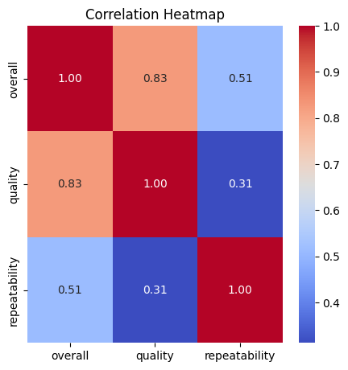
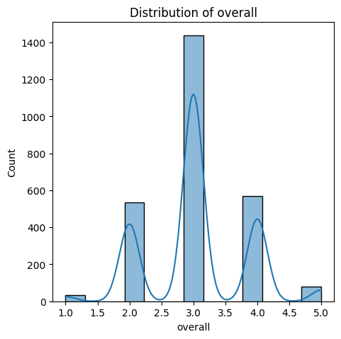
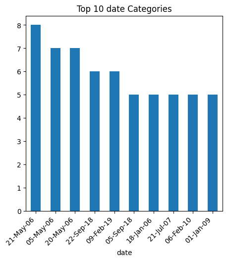

# Dataset Analysis

**Unveiling the World of Media: Analyzing the Media Dataset**

In the fast-paced world of entertainment, every title, every review, and every viewer's opinion matters. Our journey begins with a comprehensive exploration of a captivating dataset, aptly named `media.csv`, which holds the key to understanding the intricate tapestry of media consumption. This dataset comprises 2,652 entries, each shedding light on various aspects of media, encapsulated in 8 distinct columns. From the dates of release to the languages spoken and the ratings given, this dataset serves as a window into the preferences and perceptions of audiences around the globe.

### A Glimpse into the Data

As we delve deeper into the dataset, we uncover a diverse collection of media titles, ranging from blockbuster movies to indie gems. The entries span multiple languages, with English emerging as the predominant choice, appearing in nearly half of the records. The types of media are equally diverse, with "movies" dominating the scene, accounting for a staggering 83% of the entries. 

However, not everything is as straightforward as it appears. A significant portion of the dataset reveals missing values that beg for attention. Particularly, the "by" column, which identifies the creators or contributors to these media pieces, is notably incomplete, with 262 entries lacking this critical information. This gap poses a challenge for understanding the broader context of the media landscape.

### Insights and Intrigues

As we sift through the numbers, several intriguing patterns emerge. The overall rating of the media, on a scale from 1 to 5, averages around 3.05, suggesting a generally favorable reception among audiences. This is complemented by the quality rating, which stands slightly higher at an average of 3.21, indicating that viewers perceive the media’s quality to be marginally better than its overall enjoyment. 

Interestingly, the repeatability rating, averaging at 1.49, suggests that while audiences appreciate the content, they may not be inclined to revisit it frequently. This could indicate either a saturation of similar offerings or a fleeting engagement with the material. With a maximum repeatability score of 3, it's clear that most media pieces are not designed for repeated viewership.

Moreover, the dataset showcases a remarkable variety in titles, with 2,312 unique entries. "Kanda Naal Mudhal" stands out as the most frequently mentioned title, appearing 9 times, hinting at its popularity or perhaps its significance in the dataset, yet it raises questions about the criteria for such prominence.

### Recommendations for Action

To capitalize on these insights, media creators and distributors should consider several strategic actions:

1. **Targeted Marketing Campaigns**: Given the dominance of English-language media, leveraging this insight can help tailor marketing strategies that resonate with a broader audience. However, exploring content in other languages may unlock new viewer segments.

2. **Future Content Development**: With overall and quality ratings hovering around 3, there’s ample opportunity for creators to enhance the quality of their offerings. Developing content that encourages repeat viewership should be a priority, possibly through sequels, spin-offs, or franchises that capture audience loyalty.

3. **Addressing Gaps in Data**: The missing entries in the "by" column should be a call to action for better data collection practices. Understanding who is behind the media can deepen audience connections and enhance marketing strategies.

### The Broader Implications

The implications of this analysis extend far beyond mere numbers. They reflect a snapshot of our cultural consumption habits and preferences, illuminating how we engage with media. As the landscape of entertainment continues to evolve, understanding these dynamics will be crucial for creators, marketers, and distributors alike. 

In conclusion, the `media.csv` dataset offers a treasure trove of insights that, while revealing the current state of media enjoyment, also challenges stakeholders to think critically about audience engagement. It’s a call to innovate, to deepen connections, and to create media that not only entertains but resonates deeply with viewers. As we continue to peel back the layers of data, the story of our media consumption unfolds—filled with opportunities and potential waiting to be realized.

